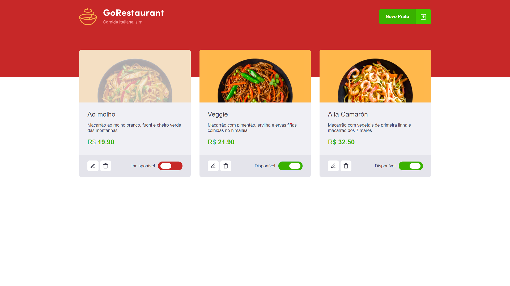

<h1 align="center">Go Restaurant</h1>
<h2 align="center">Rocketseat - Ignite - ReactJS</h2>

<h3 align="center">Chapter #2 - Challenge #2</h3>

  <a href="#-Project">Projeto</a>&nbsp;&nbsp;&nbsp;|&nbsp;&nbsp;&nbsp;
  <a href="#hammer_and_wrench-Features">Features</a>&nbsp;&nbsp;&nbsp;|&nbsp;&nbsp;&nbsp;
  <a href="#-Technologies">Tecnologias</a>&nbsp;&nbsp;&nbsp;|&nbsp;&nbsp;&nbsp;
  <a href="#-How-to-execute">Como usar</a>&nbsp;&nbsp;&nbsp;|&nbsp;&nbsp;&nbsp;
  <a href="#-Licence">Licença</a>

  

<!-- <video src="./src/assets/App.mp4" width="100%" autoplay></video> -->

## 💻 Projeto

Go Restaurant é um aplicativo que administra seus pratos. Este é o quarto desafio de ReactJS desenvolvido no curso Ignite da [Rocketseat](https://rocketseat.com.br/).

## :hammer_and_wrench: Features

- [x] Listar de pratos
- [x] Adicionar pratos
- [x] Editar pratos
- [x] Remover pratos

## ✨ Tecnologias

Este projeto foi desenvolvido com as tecnologias abaixo:

- [React](https://reactjs.org)
- [TypeScript](https://www.typescriptlang.org)
- [Styled Components](https://styled-components.com)
- [JSON Server](https://github.com/typicode/json-server)
- [Axios](https://axios-http.com)
- [React Icons](https://react-icons.github.io/react-icons)
- [React Router](https://reactrouter.com)
- [React Modal](http://reactcommunity.org/react-modal)
- [Unform](https://unform.dev)
- [Yup](https://github.com/jquense/yup)

## 🚀 Como executar o projeto

- Clone o repositório
- Instale as dependências com `yarn`
- Execute o comando `yarn server`
- Execute a aplicação com `yarn start`
- Acesse [`localhost:3000`](http://localhost:3000) no seu navegador

## 📄 Licence

Este projeto está sob a licença MIT abaixo. Leia sobre [LICENSE](./LICENSE) para mais informações.

---

Desenvolvido por Samael Melo e  Rocketseat
